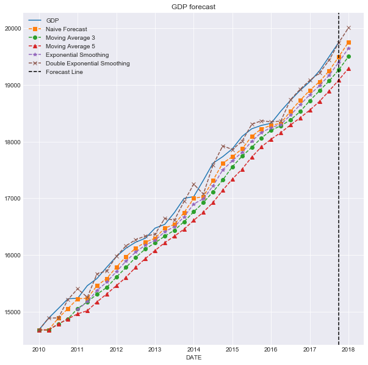
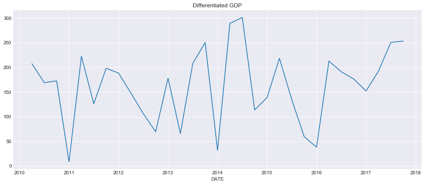
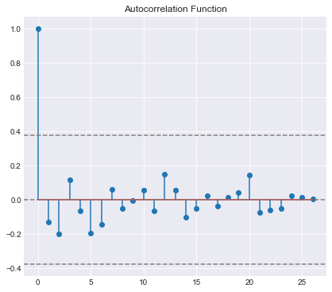
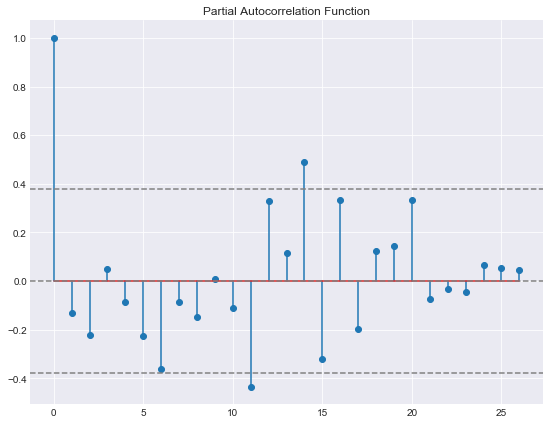
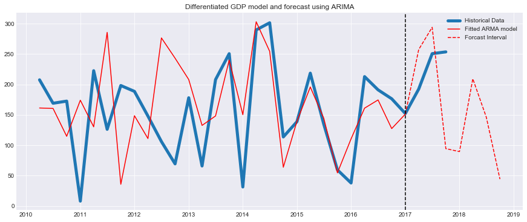
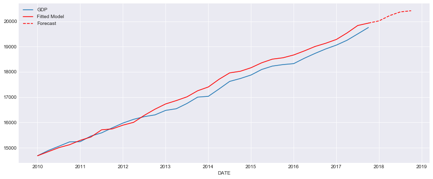

# Forecasting GDP Time Series

Author: Arash Maskooki

##### Introduction:

The objective of this analysis is to predict GDP of United States using different forecasting methods. Specially, more attention is given to developing an ARIMA model for GDP as the best model in terms of RMSE. 
Models considered are as follows:

* Naive forecast
* Moving Average
* Single Exponential Smoothing
* Double Exponential Smoothing
* ARIMA


```python
import pandas_datareader.data as dr
import datetime
import pandas as pd
import matplotlib.pyplot as plt
import seaborn as sns
import numpy as np
from fx import *
import warnings
warnings.filterwarnings('ignore')
%matplotlib notebook
```

Getting historical data from online source,


```python
gdp = dr.DataReader('GDP', 'fred')
```

Applying naive forecast, moving average with 3 and 5 window lengths, single and double exponential smoothing.

Implementation of these functions are in auxiliary function file 'fx.py'


```python
nv = gdp.iloc[0]
ma3 = gdp.iloc[0]
ma5 = gdp.iloc[0]
es = gdp.iloc[0]
for i in range(1,len(gdp)+1):
    nv = nv.append(naive(gdp.iloc[:i]),ignore_index=True)
    ma3 = ma3.append(moving_avg(gdp.iloc[:i], 3),ignore_index=True)
    ma5 = ma5.append(moving_avg(gdp.iloc[:i], 5),ignore_index=True)
    es = es.append(expo_smooth(gdp.iloc[:i], .7),ignore_index=True)
des = double_expo_smooth(gdp, .98, .98)
des = pd.Series(data=des)
```

Now we forecast GDP for one step ahead in the future where historical data is still not available,


```python
forecastDate = gdp.index[-1] + datetime.timedelta(days=3*31-1)
```


```python
nv.index = gdp.index.insert(len(gdp),forecastDate)
ma3.index = gdp.index.insert(len(gdp),forecastDate)
ma5.index = gdp.index.insert(len(gdp),forecastDate)
es.index = gdp.index.insert(len(gdp),forecastDate)
des.index = gdp.index.insert(len(gdp),forecastDate)
```


```python
plt.figure()
sns.set_style("darkgrid")
gdp.plot(figsize=(10,10))
nv.plot(style='s--')
ma3.plot(style='o--')
ma5.plot(style='^--')
es.iloc[4:].plot(style='*--')
des.plot(style='x--')

plt.axvline(x=gdp.index[-1], color='k', linestyle='--')

plt.legend(['GDP','Naive Forecast','Moving Average 3',
            'Moving Average 5', 'Exponential Smoothing',
            'Double Exponential Smoothing','Forecast Line'])
plt.title('GDP forecast');
```


    <matplotlib.figure.Figure at 0x2c112454a58>





```python
L = len(gdp.iloc[1:])
nv_rmse = np.sqrt((gdp.iloc[1:].subtract(nv[1:-1], axis=0)**2).sum()/L).values
ma3_rmse = np.sqrt((gdp.iloc[1:].subtract(ma3[1:-1], axis=0)**2).sum()/L).values
ma5_rmse = np.sqrt((gdp.iloc[1:].subtract(ma5[1:-1], axis=0)**2).sum()/L).values
es_rmse = np.sqrt((gdp.iloc[1:].subtract(es[1:-1], axis=0)**2).sum()/L).values
des_rmse = np.sqrt((gdp.iloc[1:].subtract(des[1:-1], axis=0)**2).sum()/L).values
```


```python
print('RMSE Error for:')
print('1. Naive Forecast: {}'.format(nv_rmse[0])); 
print('2. Moving average (3): {}'.format(ma3_rmse[0])); 
print('3. Moving average (5): {}'.format(ma5_rmse[0])) ;
print('4. Exponential Smoothing: {}'.format(es_rmse[0])) ;
print('4. Double Exponential Smoothing: {}'.format(des_rmse[0])) ;
```

    RMSE Error for:
    1. Naive Forecast: 179.66148204932867
    2. Moving average (3): 327.06195073915535
    3. Moving average (5): 468.3980254575388
    4. Exponential Smoothing: 912.1061944599035
    4. Double Exponential Smoothing: 107.51422875560671
    

Based on RMSE criterion Double Exponential Smoothing has the best performance among the above methods.

Now we try ARIMA model.

## ARIMA model


```python
from statsmodels.tsa.arima_model import ARIMA
from statsmodels.tsa.stattools import acf, pacf
from matplotlib.pylab import rcParams
rcParams['figure.figsize'] = 15, 6
```

The series is clearly non-stationary; It has a trend and the mean is not constant. Hence we differentiate it to make it stationary,


```python
dgdp = gdp.diff()[1:]
dgdp = pd.Series(dgdp['GDP'])
plt.figure()
dgdp.plot()
plt.title('Differentiated GDP')
```


    Text(0.5,1,'Differentiated GDP')





Dividing data into training set and test set,


```python
n_train_test = 27
dgdp_train = dgdp[:n_train_test]
dgdp_test = dgdp[n_train_test:]

predic_index = dgdp_test.index
predic_index
```


    DatetimeIndex(['2017-01-01', '2017-04-01', '2017-07-01', '2017-10-01'], dtype='datetime64[ns]', name='DATE', freq=None)


Adding prediction dates beyond historical data,


```python
interval = predic_index[-1]-predic_index[-2]
predic_index = predic_index.append(pd.DatetimeIndex([predic_index[-1] + i * interval for i in range(1,5)]))
predic_index
```


    DatetimeIndex(['2017-01-01', '2017-04-01', '2017-07-01', '2017-10-01',
                   '2018-01-01', '2018-04-03', '2018-07-04', '2018-10-04'],
                  dtype='datetime64[ns]', freq=None)


To check if the differe ntiated signal is stationary and also determine the order of ARIMA model we plot ACF and PACF,


```python
n_lags = min([len(dgdp_train)-1,30])
lag_acf = acf(dgdp_train, nlags=n_lags)
lag_pacf = pacf(dgdp_train, nlags=n_lags, method='ols')
```


```python
#Plot ACF: 
plt.subplot(121) 
plt.stem(lag_acf)
plt.axhline(y=0,linestyle='--',color='gray')
plt.axhline(y=-1.96/np.sqrt(len(dgdp_train)),linestyle='--',color='gray')
plt.axhline(y=1.96/np.sqrt(len(dgdp_train)),linestyle='--',color='gray')
plt.title('Autocorrelation Function')
```


    Text(0.5,1,'Autocorrelation Function')





```python
#Plot PACF:
plt.subplot(122)
plt.stem(lag_pacf)
plt.axhline(y=0,linestyle='--',color='gray')
plt.axhline(y=-1.96/np.sqrt(len(dgdp_train)),linestyle='--',color='gray')
plt.axhline(y=1.96/np.sqrt(len(dgdp_train)),linestyle='--',color='gray')
plt.title('Partial Autocorrelation Function')
plt.tight_layout()
```





There is no sign of non-stationarity in ACF and PACF plots, to test this hypothesis we perform unit root test (Dickey-Fuller)


```python
from statsmodels.tsa.stattools import adfuller
```


```python
#Perform Dickey-Fuller test:
print('Results of Dickey-Fuller Test:')
dftest = adfuller(dgdp_train, autolag='AIC')
print(dftest)
dfoutput = pd.Series(dftest[0:4], index=['Test Statistic','p-value','#Lags Used','Number of Observations Used'])
print(dfoutput)
```

    Results of Dickey-Fuller Test:
    (-2.8873626229136806, 0.04683741183900975, 5, 21, {'1%': -3.7883858816542486, '5%': -3.013097747543462, '10%': -2.6463967573696143}, 200.71637887616652)
    Test Statistic                 -2.887363
    p-value                         0.046837
    #Lags Used                      5.000000
    Number of Observations Used    21.000000
    dtype: float64
    

The test confirms that the process is stationary. Next, we fit the model to training data, 


```python
model = ARIMA(dgdp_train, order=(11, 0, 0)) 
results_AR = model.fit(disp=-1) 
predicted = results_AR.predict(start=predic_index[0], end=predic_index[-1])
dgdp_fitted = results_AR.fittedvalues.append(predicted)

```


```python
print(results_AR.summary())
plt.plot(dgdp, linewidth=5)
plt.plot(dgdp_fitted[:n_train_test+1], color='red')
plt.plot(dgdp_fitted[n_train_test:], color='red', linestyle='--')
plt.axvline(x=predic_index[0], color='k', linestyle='--')
plt.title('Differentiated GDP model and forecast using ARIMA')
plt.legend(['Historical Data','Fitted ARMA model','Forcast Interval'])
plt.show()
```

                                  ARMA Model Results                              
    ==============================================================================
    Dep. Variable:                    GDP   No. Observations:                   27
    Model:                    ARMA(11, 0)   Log Likelihood                -167.878
    Method:                       css-mle   S.D. of innovations             68.077
    Date:                Wed, 25 Apr 2018   AIC                            361.756
    Time:                        09:23:05   BIC                            378.602
    Sample:                    04-01-2010   HQIC                           366.765
                             - 10-01-2016                                         
    ==============================================================================
                     coef    std err          z      P>|z|      [0.025      0.975]
    ------------------------------------------------------------------------------
    const        161.2581        nan        nan        nan         nan         nan
    ar.L1.GDP     -0.3722   1.13e-05  -3.28e+04      0.000      -0.372      -0.372
    ar.L2.GDP     -0.4410   1.41e-05  -3.12e+04      0.000      -0.441      -0.441
    ar.L3.GDP      0.2677    3.1e-06   8.64e+04      0.000       0.268       0.268
    ar.L4.GDP     -0.0897   2.75e-07  -3.27e+05      0.000      -0.090      -0.090
    ar.L5.GDP     -0.3377        nan        nan        nan         nan         nan
    ar.L6.GDP     -0.8216   6.54e-06  -1.26e+05      0.000      -0.822      -0.822
    ar.L7.GDP     -0.5423   5.94e-06  -9.13e+04      0.000      -0.542      -0.542
    ar.L8.GDP     -0.1442    9.8e-06  -1.47e+04      0.000      -0.144      -0.144
    ar.L9.GDP      0.1140   3.08e-05   3704.013      0.000       0.114       0.114
    ar.L10.GDP    -0.0477   1.96e-05  -2429.404      0.000      -0.048      -0.048
    ar.L11.GDP    -0.2540   9.35e-07  -2.72e+05      0.000      -0.254      -0.254
                                        Roots                                     
    ==============================================================================
                      Real           Imaginary           Modulus         Frequency
    ------------------------------------------------------------------------------
    AR.1            -1.2951           -0.0000j            1.2951           -0.5000
    AR.2            -0.9134           -0.6400j            1.1153           -0.4027
    AR.3            -0.9134           +0.6400j            1.1153            0.4027
    AR.4            -0.4945           -0.9492j            1.0702           -0.3264
    AR.5            -0.4945           +0.9492j            1.0702            0.3264
    AR.6            -0.0155           -0.9999j            1.0000           -0.2525
    AR.7            -0.0155           +0.9999j            1.0000            0.2525
    AR.8             0.8751           -0.5144j            1.0151           -0.0846
    AR.9             0.8751           +0.5144j            1.0151            0.0846
    AR.10            1.1019           -0.9255j            1.4390           -0.1112
    AR.11            1.1019           +0.9255j            1.4390            0.1112
    ------------------------------------------------------------------------------
    





To obtain GDP we have to integrate 'dgdp' variable and add the base value GDP


```python

gdp_predict = dgdp_fitted.cumsum() + gdp['GDP'][0]
gdp_predict = pd.concat([gdp['GDP'][0:1],gdp_predict])
plt.figure()
gdp['GDP'].plot()
gdp_predict[:len(gdp)].plot(style='r')
gdp_predict[len(gdp)-1:].plot(style='r--')

plt.legend(['GDP','Fitted Model','Forecast'])
```


    <matplotlib.legend.Legend at 0x2c114aba3c8>





```python
gdps = gdp.GDP
ARIMA_RMSE = np.sqrt(sum((gdp_predict[dgdp_test.index]-gdps[dgdp_test.index])**2)/len(results_AR.fittedvalues))
print('ARIMA RMSE: {:.4}'.format(ARIMA_RMSE))
```

    ARIMA RMSE: 100.8
    

Hence ARIMA model has slightly better RMSE performance (~7%) than double exponential smoothing
