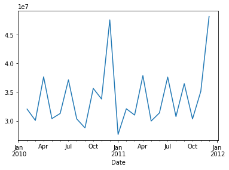
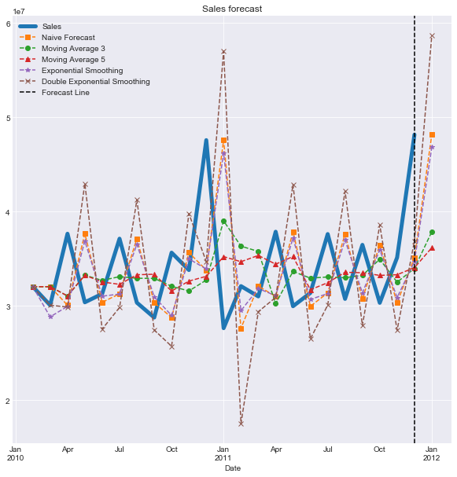
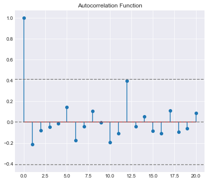
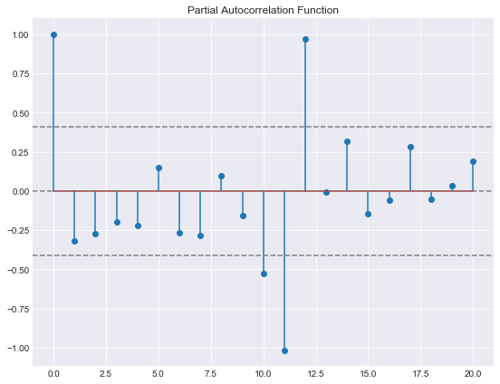
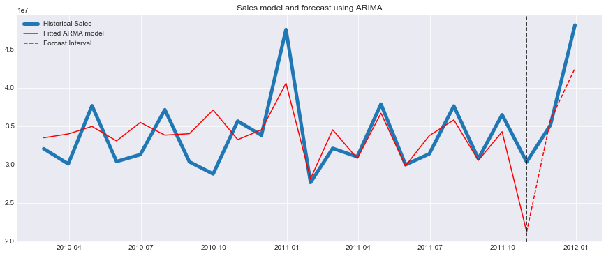

# Forecasting Sales Time Series

Author: Arash Maskooki

##### Introduction:

The objective of this analysis is to predict sales using different forecasting methods. Specially, more attention is given to developing an ARIMA model for sales as the best model in terms of RMSE. 
Models considered are as follows:

* Naive forecast
* Moving Average
* Single Exponential Smoothing
* Double Exponential Smoothing
* ARIMA


The data for this analysis is obtained from the following source:
https://www.kaggle.com/c/priceforecast/data


```python
import pandas_datareader.data as dr
import datetime
import pandas as pd
import matplotlib.pyplot as plt
import seaborn as sns
import numpy as np
from fx import *
import warnings
warnings.filterwarnings('ignore')
%matplotlib notebook
```

Data is reported weekly; for the purpose of this analysis we convert data into monthly by aggregating weekly data and summing up.


```python
df = pd.read_csv('sales.csv')
df.index = pd.to_datetime(df.Date)
sales = df['Weekly_Sales']
sales = sales.resample('M').sum()
sales.name = 'Monthly_Sales'
sales.plot()
```


    <matplotlib.axes._subplots.AxesSubplot at 0x27f3f9c2d68>





The plot of the data shows periodicity of sale specially a harmonic every 11 to 12 month around December and some monthly ups and downs. Applying naive forecast, moving average with 3 and 5 window lengths, single and double exponential smoothing.

Implementation of these functions are in auxiliary function file 'fx.py'


```python
nv = sales.iloc[0]
ma3 = sales.iloc[0]
ma5 = sales.iloc[0]
es = sales.iloc[0]
for i in range(1,len(sales)+1):
    nv = np.append(nv, naive(sales.iloc[:i]))
    ma3 = np.append(ma3, moving_avg(sales.iloc[:i], 3))
    ma5 = np.append(ma5, moving_avg(sales.iloc[:i], 5))
    es = np.append(es, expo_smooth(sales.iloc[:i], .9))

des = double_expo_smooth(sales, .9, .9)
```


```python
forecastDate = sales.index[-1] + datetime.timedelta(days=31)
```


```python
nv = pd.Series(data=nv)
nv.index = sales.index.insert(len(sales),forecastDate)
ma3 = pd.Series(data=ma3)
ma3.index = sales.index.insert(len(sales),forecastDate)
ma5 = pd.Series(data=ma5)
ma5.index = sales.index.insert(len(sales),forecastDate)
es = pd.Series(data=es)
es.index = sales.index.insert(len(sales),forecastDate)
des = pd.Series(data=des)
des.index = sales.index.insert(len(sales),forecastDate)
```


```python
plt.figure()
sns.set_style("darkgrid")
sales.plot(figsize=(10,10), linewidth=5)
nv.plot(style='s--')
ma3.plot(style='o--')
ma5.plot(style='^--')
es.plot(style='*--')
des.plot(style='x--')

plt.axvline(x=sales.index[-1], color='k', linestyle='--')

plt.legend(['Sales','Naive Forecast','Moving Average 3',
            'Moving Average 5', 'Exponential Smoothing',
            'Double Exponential Smoothing','Forecast Line'])
plt.title('Sales forecast');
```





All of the above forecasting methods forecast increase in sale in January as they do not take into account periodicity. However, the sale will probably go down significantly same as previous year.


```python
L = len(sales.iloc[1:])
nv_rmse = np.sqrt((sales.iloc[1:].subtract(nv[1:-1], axis=0)**2).sum()/L)
ma3_rmse = np.sqrt((sales.iloc[1:].subtract(ma3[1:-1], axis=0)**2).sum()/L)
ma5_rmse = np.sqrt((sales.iloc[1:].subtract(ma5[1:-1], axis=0)**2).sum()/L)
es_rmse = np.sqrt((sales.iloc[1:].subtract(es[1:-1], axis=0)**2).sum()/L)
des_rmse = np.sqrt((sales.iloc[1:].subtract(des[1:-1], axis=0)**2).sum()/L)
```

Root mean square error of prediction for the above method are as follows:


```python
print('RMSE Error for:')
print('1. Naive Forecast: {:.3f}m'.format(nv_rmse/1e6)); 
print('2. Moving average (3): {:.3f}m'.format(ma3_rmse/1e6)); 
print('3. Moving average (5): {:.3f}m'.format(ma5_rmse/1e6)) ;
print('4. Exponential Smoothing: {:.3f}m'.format(es_rmse/1e6)) ;
print('4. Double Exponential Smoothing: {:.3f}m'.format(des_rmse/1e6)) ;
```

    RMSE Error for:
    1. Naive Forecast: 7.744m
    2. Moving average (3): 6.201m
    3. Moving average (5): 5.699m
    4. Exponential Smoothing: 7.388m
    4. Double Exponential Smoothing: 10.749m
    

# ARIMA Model

In this section we model sales data using ARIMA model. First we identify parameters of the model and then predict future sales using the model.

For ARIMA to work. the time series should be stationary. To check the stationarity of the process and identify the degrees of AR and MA models we plot ACF and PACF of the process we plot ACF and PACF graphs:


```python
from statsmodels.tsa.stattools import acf, pacf
from matplotlib.pylab import rcParams
rcParams['figure.figsize'] = 15, 6
```


```python
lag_acf = acf(sales, nlags=20)
lag_pacf = pacf(sales, nlags=20, method='ols')
```


```python
#Plot ACF: 
plt.subplot(121) 
plt.stem(lag_acf)
plt.axhline(y=0,linestyle='--',color='gray')
plt.axhline(y=-1.96/np.sqrt(len(sales)),linestyle='--',color='gray')
plt.axhline(y=1.96/np.sqrt(len(sales)),linestyle='--',color='gray')
plt.title('Autocorrelation Function')
```


    Text(0.5,1,'Autocorrelation Function')





```python
#Plot PACF:
plt.subplot(122)
plt.stem(lag_pacf)
plt.axhline(y=0,linestyle='--',color='gray')
plt.axhline(y=-1.96/np.sqrt(len(sales)),linestyle='--',color='gray')
plt.axhline(y=1.96/np.sqrt(len(sales)),linestyle='--',color='gray')
plt.title('Partial Autocorrelation Function')
plt.tight_layout()
```





There is no sign of non-stationarity in ACF and PACF graphs. In addition, the model seems to be AR with degree 11 or 12 which indicates a yearly peak in sale around December. To confirm stationarity we perform unit roots test (Dickey–Fuller).

### Unit Root Test


```python
from statsmodels.tsa.stattools import adfuller
```


```python
#Perform Dickey-Fuller test:
print('Results of Dickey-Fuller Test:')
dftest = adfuller(sales, autolag='AIC')
dfoutput = pd.Series(dftest[0:4], index=['Test Statistic','p-value','#Lags Used','Number of Observations Used'])
print(dfoutput)
```

    Results of Dickey-Fuller Test:
    Test Statistic                 -4.997686
    p-value                         0.000022
    #Lags Used                      0.000000
    Number of Observations Used    22.000000
    dtype: float64
    


    Date
    2010-02-28    32043668.70
    2010-03-31    30075291.51
    2010-04-30    37657332.68
    2010-05-31    30384581.13
    2010-06-30    31281914.79
    2010-07-31    37132062.90
    2010-08-31    30344848.17
    2010-09-30    28767042.45
    2010-10-31    35651411.63
    2010-11-30    33805155.86
    2010-12-31    47587627.64
    2011-01-31    27639020.63
    2011-02-28    32101354.08
    2011-03-31    31005353.72
    2011-04-30    37870451.07
    2011-05-31    29967416.85
    2011-06-30    31378081.30
    2011-07-31    37623398.29
    2011-08-31    30745379.88
    2011-09-30    36477342.08
    2011-10-31    30328531.20
    2011-11-30    35133439.41
    2011-12-31    48168784.59
    Freq: M, Name: Monthly_Sales, dtype: float64


We reject the null hypothesis hence there is no unit root and the process is stationary.

### ARIMA model


```python
from statsmodels.tsa.arima_model import ARIMA
```


```python
sales_train = sales[:20]
sales_test = sales[20:]
predic_index = sales_test.index
predic_index
```


    DatetimeIndex(['2011-10-31', '2011-11-30', '2011-12-31'], dtype='datetime64[ns]', name='Date', freq='M')


```python
model = ARIMA(sales_train, order=(11, 0, 0)) 
results_AR = model.fit(disp=-1) 
predicted = results_AR.predict(start=predic_index[0], end=predic_index[-1])
sales_fitted = results_AR.fittedvalues.append(predicted)

```

A significant lag of 11 month indicates a yearly cycle.


```python
print(results_AR.summary())
plt.plot(sales, linewidth=5)
plt.plot(sales_fitted[:21], color='red')
plt.plot(sales_fitted[20:], color='red', linestyle='--')
plt.axvline(x=predic_index[0], color='k', linestyle='--')
plt.title('Sales model and forecast using ARIMA')
plt.legend(['Historical Sales','Fitted ARMA model','Forecast Interval'])
plt.show()

```

                                  ARMA Model Results                              
    ==============================================================================
    Dep. Variable:          Monthly_Sales   No. Observations:                   20
    Model:                    ARMA(11, 0)   Log Likelihood                -325.354
    Method:                       css-mle   S.D. of innovations        1589544.778
    Date:                Sun, 22 Apr 2018   AIC                            676.708
    Time:                        21:27:37   BIC                            689.653
    Sample:                    02-28-2010   HQIC                           679.235
                             - 09-30-2011                                         
    ========================================================================================
                               coef    std err          z      P>|z|      [0.025      0.975]
    ----------------------------------------------------------------------------------------
    const                 3.348e+07   2.61e+05    128.436      0.000     3.3e+07     3.4e+07
    ar.L1.Monthly_Sales     -0.9080      0.218     -4.164      0.003      -1.335      -0.481
    ar.L2.Monthly_Sales     -0.3037      0.408     -0.744      0.478      -1.104       0.497
    ar.L3.Monthly_Sales     -0.4905      0.451     -1.087      0.309      -1.375       0.394
    ar.L4.Monthly_Sales     -0.6662      0.453     -1.471      0.180      -1.554       0.222
    ar.L5.Monthly_Sales     -0.3551      0.496     -0.716      0.494      -1.327       0.616
    ar.L6.Monthly_Sales     -0.4044      0.501     -0.807      0.443      -1.387       0.578
    ar.L7.Monthly_Sales     -0.6582      0.453     -1.453      0.184      -1.546       0.230
    ar.L8.Monthly_Sales     -0.4257      0.448     -0.950      0.370      -1.304       0.453
    ar.L9.Monthly_Sales     -0.3108      0.407     -0.764      0.467      -1.108       0.486
    ar.L10.Monthly_Sales    -0.9176      0.223     -4.110      0.003      -1.355      -0.480
    ar.L11.Monthly_Sales    -0.8943      0.081    -11.028      0.000      -1.053      -0.735
                                        Roots                                     
    ==============================================================================
                      Real           Imaginary           Modulus         Frequency
    ------------------------------------------------------------------------------
    AR.1             0.9079           -0.4316j            1.0053           -0.0706
    AR.2             0.9079           +0.4316j            1.0053            0.0706
    AR.3             0.5687           -0.8270j            1.0037           -0.1541
    AR.4             0.5687           +0.8270j            1.0037            0.1541
    AR.5             0.0553           -1.0008j            1.0023           -0.2412
    AR.6             0.0553           +1.0008j            1.0023            0.2412
    AR.7            -0.6156           -0.8099j            1.0173           -0.3534
    AR.8            -0.6156           +0.8099j            1.0173            0.3534
    AR.9            -0.9154           -0.4355j            1.0138           -0.4293
    AR.10           -0.9154           +0.4355j            1.0138            0.4293
    AR.11           -1.0280           -0.0000j            1.0280           -0.5000
    ------------------------------------------------------------------------------
    





```python
ARIMA_RMSE = np.sqrt(sum((predicted-sales_test)**2)/len(results_AR.fittedvalues))
print('ARIMA RMSE: {:.4}'.format(ARIMA_RMSE))
```

    ARIMA RMSE: 2.403e+06
    

In the plot above, the data on the right side of the vertical dotted line is used for training while the data forecast by the model is shown by red dotted line on the left side of the vertical line. Actual sales values are shown by solid blue line.
